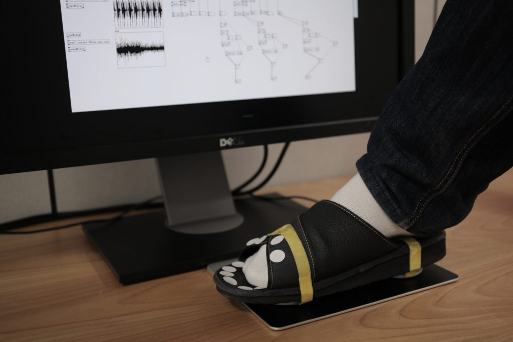
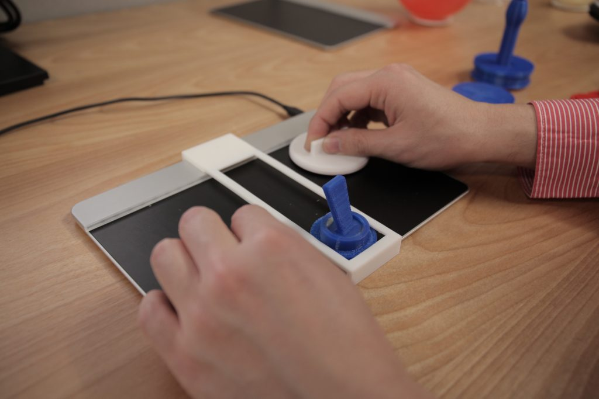
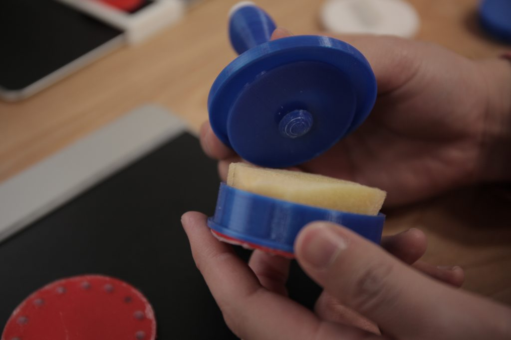

ForceStamps are fiducial markers for supporting rapid prototyping of physical control interfaces on pressure-sensitive touch surfaces. ForceStamps can be persistently tracked on surfaces along with the force information and other attributes. Designers without knowledge of electronics can rapidly prototype physical controls by attaching mechanisms to ForceStamps, while manipulating the haptic feedback with buffer materials. The created control widgets can be spatially configured on the touch surface to make an interface layout.

Detail of the workshop: [GCL GDWS Workshop C](https://gcl-gdws.org/workshop-c/2019/musical-intrument-interface-design-with-tangible-markers-and-pressure-sensitive-sensor-array/)

