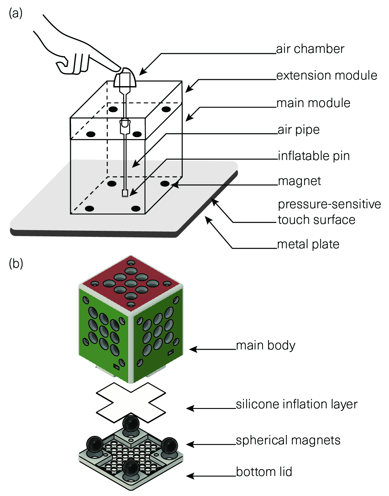
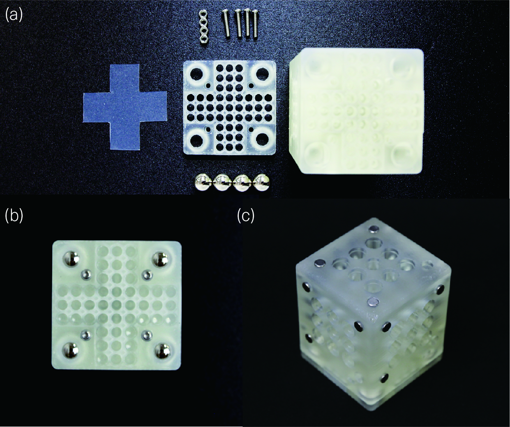
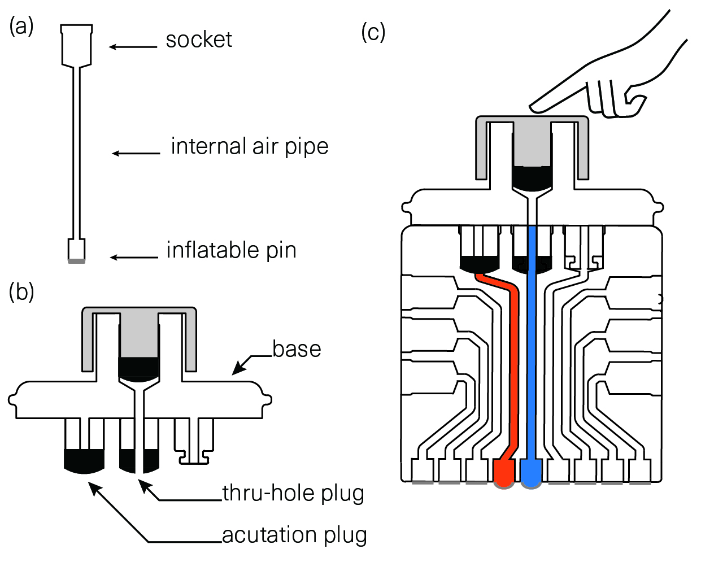
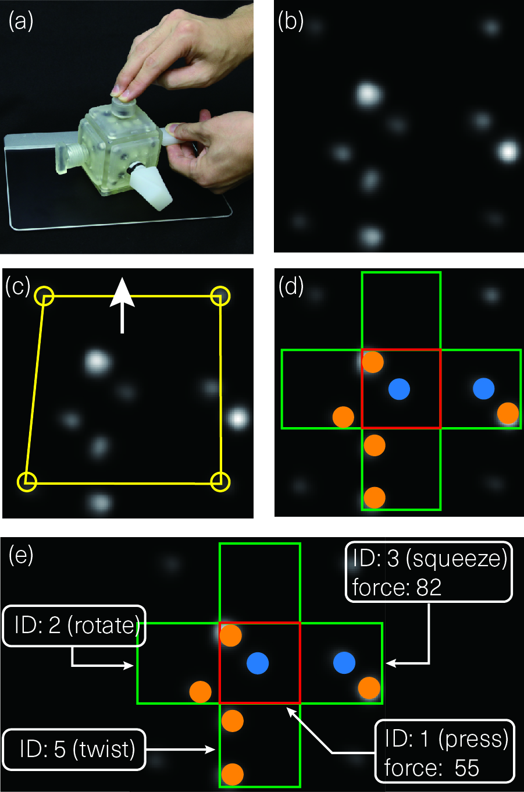
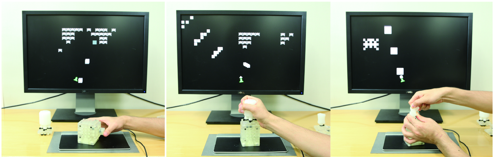
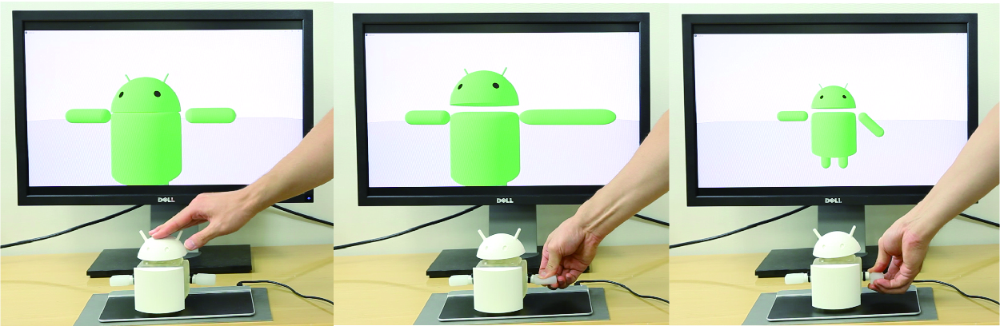

We present PneuModule, a tangible interface platform that enables users to reconfigure physical controls on pressure-sensitive touch surfaces using pneumatically-actuated inflatable pin arrays. PneuModule consists of a main module and extension modules. The main module is tracked on the touch surface and forwards continuous inputs from attached multiple extension modules to the touch surface. Extension modules have distinct mechanisms for user input, which pneumatically actuates the inflatable pins at the bottom of the main module through internal air pipes. The main module accepts multi-dimensional inputs since each pin is individually inflated by the corresponding air chamber. Also, since the extension modules are swappable and identifiable owing to the marker design, users can quickly customize the interface layout. We contribute to design details of inflatable pins and diverse pneumatic input control design examples for PneuModule. We also showcase the feasibility of PneuModule through a series of evaluations and interactive prototypes.

